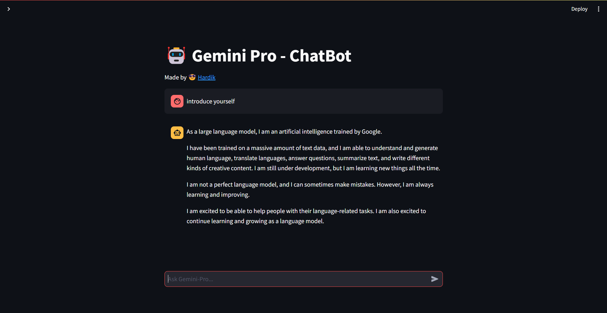

# GeminiPro ChatBot [](https://geminipro-chatbot.streamlit.app/)

Gemini Chatbot is an interactive chatbot built using Streamlit and Google's **Gemini-Pro** AI model. It allows users to converse with an AI assistant powered by Gemini-Pro to get responses to their queries.

#### Features

- Allows users to interact with an AI assistant powered by Google's Gemini-Pro AI model.
- Displays chat history, including both user and chatbot messages.
- Provides a responsive and intuitive chat interface for smooth communication.
- Configurable sidebar for entering the Google API Key for Gemini-Pro configuration.


#### Image



#### Installation and Usage

1. **Clone the Repository:**
   ```bash
   git clone https://github.com/hardikjp7/GeminiPro-ChatBot.git
   ```

2. **Navigate to Project Directory:**
   ```bash
   cd GeminiPro-ChatBot
   ```

3. **Install Dependencies:**
   ```bash
   pip install -r requirements.txt
   ```

4. **Set Up Google API Key:**
   - Obtain a Google API Key from [Google Makersuite](https://makersuite.google.com/app/apikey) and securely save it.
   - Enter the Google API Key in the Streamlit app's sidebar configuration section.

5. **Run the Streamlit App:**
   ```bash
   streamlit run app.py
   ```

6. **Open the Web Browser:**
   Once the Streamlit app is running, open your web browser and go to `http://localhost:8501` to access the Gemini-Pro Chatbot.


### Note:

Ensure that you have obtained the necessary Google API Key and saved it securely before running the Streamlit app.
